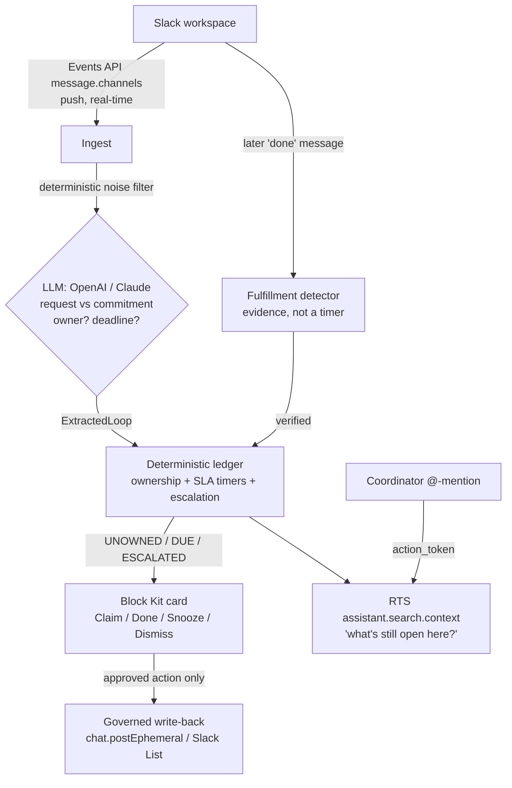

# Loose Ends

**Loose Ends catches asks in Slack that nobody accepted, and only marks them
done once it finds evidence the work actually happened.**

It's like a helpdesk unassigned-ticket queue, but for the ordinary conversation
of a mission-driven team, and it verifies the fix instead of trusting a timer.

**Track:** Slack Agent for Good (nonprofit operations / frontline mission orgs).

## Uniqueness claim (locked)

No existing tool combines **unowned-request detection** (an ask nobody accepted,
distinct from a personal commitment someone forgot) + **deterministic escalation
to a pre-designated backup human** + **evidence-based fulfillment verification**
(confirming the work landed from the conversation, not just that a deadline
passed) — all tracked through a **deterministic, auditable ownership state
machine**, aimed at social-impact Slack workspaces.

Commitment detection is now commoditized (Commitment Crawler, Claryti, Sleuth,
Day.ai). Routing/escalation is going native (Salesforce's March 2026 Slackbot
update ships an escalation template). The one thing **nothing else does** is close
the loop on *evidence*: every commitment bot marks a task done when a timer runs
out or a button is clicked. Loose Ends keeps a loop **open** if the deadline
passes with no proof the work happened, because *closed is not done*.

## The problem, with a number

In a nonprofit, mutual-aid, or community-health Slack, an unanswered "can someone
follow up with the Diaz family?" is not a slipped deck. It is a person not
served. The message scrolls away, everyone assumes someone else has it, and
nobody does.

> **Even when a social-services referral is logged and marked "closed," only 38%
> of clients actually received the service** — down from 65% in an earlier period,
> across 115,316 referrals in a 26-county network (JAMA Network Open, 2024). The
> loop *looked* closed. The person wasn't served. That gap is exactly what
> evidence-based verification is built to catch.

## How this differs from what already exists

I re-checked the prior art (July 2026). The "detect a Slack promise and nudge"
mechanic is fully taken. Here is where Loose Ends does something they do not:

| Capability | Commitment Crawler / Claryti | Follow Up Bot | ClearFeed / Suptask | Slackbot native (2026) | **Loose Ends** |
| --- | --- | --- | --- | --- | --- |
| First-person commitments | Yes | No | No | Partial | Yes |
| **Unowned requests (nobody accepted it)** | No | Partial (no-reply) | Ticket queues only | No | **Yes** |
| **Escalation to a designated backup human** | No | No | Support SLA | Template (reactive) | **Yes** |
| **Evidence-based fulfillment verification** | No (timers) | No | No | No | **Yes** |
| **Deterministic, auditable state machine** | No | No | No | No | **Yes** |
| **Social-impact / frontline focus** | No | No | No | No | **Yes** |

## How it maps to the judging criteria

| Criterion | How Loose Ends scores |
| --- | --- |
| **Technological Implementation** | Three eligible technologies, each load-bearing: Slack AI (a real LLM call — bring-your-own-model, OpenAI or Claude — does the request-vs-commitment judgment), the Real-Time Search API (an on-demand "what's still open here?" lookup), and Block Kit + Events API as the governed action layer. A deterministic ledger underneath makes every status decision reproducible and auditable. |
| **Design** | Restraint is the UX. Silent on filler; a calm claim card only when an ask is unowned; a louder escalation only when it drops; one-tap Claim / Done / Snooze / Dismiss. Never spams a channel. |
| **Potential Impact** | Targets dropped work in mission-driven workspaces, where the downstream harm is a person, not a deliverable, and is quantifiable (see above). |
| **Quality of the Idea** | Reframes the saturated "commitment bot" into the un-served ownership-gap problem, and adds the one capability none of them have: verifying the work actually landed. |

## Architecture

The design was corrected against how the Slack APIs actually work. **RTS is a
pull/query API, not a passive stream** (its bot calls need an ephemeral
action_token that only arrives on @-mention/DM, and it forbids storing results),
so ingestion runs on the **Events API push stream**, and RTS is used for exactly
what it is for: an on-demand lookup.



- **Events API** = the eyes. A real-time push stream, not throttled the way
  channel history is. This is how the agent sees every message.
- **LLM (Slack AI, bring-your-own-model)** = the judgment. A real OpenAI or Claude
  call classifies request vs commitment, owner, deadline — the nuance a regex
  cannot make.
- **Deterministic ledger** = the spine. Ownership, SLA timers, escalation,
  dedupe, and a full audit log. Reproducible and independent of what the model
  said.
- **Evidence-based fulfillment** = the moat. Watches the same stream for a later
  message that proves the work landed, and only then closes the loop.
- **RTS API** = an on-demand "what's still open here?" lookup when a coordinator
  asks. Honest, in-bounds use of the eligible technology.
- **Block Kit + governed write-back** = the hands. Nothing is written to a system
  of record without an explicit approved action behind a human gate.

### Deterministic vs generative split

The generative layer (your LLM — OpenAI or Claude) only classifies and extracts,
and confirms fulfillment evidence. Every *status* decision — ownership, escalation timers,
break, dedupe — is deterministic, reproducible, and logged. That is what makes
the escalation trustworthy and the behavior auditable, and it is what a
prompt-only clone lacks.

### The state machine

```
UNOWNED   ──claimed──────────────> CLAIMED
UNOWNED   ──response SLA passes──> ESCALATED   (ping the backup human)
CLAIMED   ──deadline passes──────> DUE
DUE       ──grace passes─────────> ESCALATED
ESCALATED ──escalation grace─────> BROKEN
any       ──evidence / done──────> FULFILLED   (verified, not timed out)
any       ──snooze──────────────> SNOOZED ──ends──> UNOWNED | CLAIMED
any       ──reviewer dismiss────> DISMISSED
```

## The numbers (honest)

A regex clone of "detect a promise" is a weekend build. So the eval corpus is
deliberately built to include the phrasings a keyword filter can't see (implied
unowned asks like *"the Diaz family still hasn't heard back"*, commitments
without "I'll" like *"sending the report this afternoon"*) and the traps it false-
fires on (*"I'll be out Friday"*). On that 48-message frontline corpus:

| Extractor | Precision | Recall | False-positive rate | Kind accuracy |
| --- | --- | --- | --- | --- |
| Regex clone (`npm run eval`) | 76.5% | 52.0% | 17.4% | 100% |
| **LLM extractor** — OpenAI `gpt-4o-mini` (`npm run eval:llm`) | **92.6%** | **100%** | **8.7%** | **100%** |

The delta is the argument: the AI takes **recall from 52% to 100%** — it catches
every dropped ask a keyword filter can't see — while **halving the false-positive
rate** (17.4% → 8.7%) and nailing the request-vs-commitment split. That is where
the AI is load-bearing, not bolted on. `npm run eval` prints exactly which
messages each extractor misses and which it false-fires on. (Measured on
`gpt-4o-mini`; swap `LOOSE_ENDS_MODEL` for a stronger model to push it further.)

## Repo layout

```
src/types.ts          domain types (platform-agnostic)
src/ledger.ts         deterministic open-loop state machine + escalation   <- the moat
src/dates.ts          natural-language deadline grounding (pure, tested)
src/extractor.ts      noise pre-filter + Claude / heuristic extraction
src/llm.ts            real LLM calls (OpenAI or Claude): classify + confirm fulfillment
src/fulfillment.ts    evidence-based fulfillment detection from the stream
src/actions.ts        Block Kit card model + review-gate decisions
src/watcher.ts        offline message source for the no-workspace demo
src/index.ts          the offline demo (mocks, no workspace, negative control)
src/config.ts         env-driven config (no secrets in source)
src/slack/app.ts      the REAL agent: Bolt + Socket Mode, live end to end
src/slack/blockkit.ts LoopCard -> Block Kit rendering (pure, tested)
src/slack/rts.ts      on-demand RTS assistant.search.context lookup
eval/corpus.jsonl     labeled frontline open-loops vs noise
eval/evaluate.ts      precision / recall / false-positive / kind-accuracy harness
test/                 unit tests for the ledger, dates, and extractor
manifest.json         the Slack app manifest (paste into api.slack.com)
```

## Run the real agent (in your sandbox)

1. Join the [Slack Developer Program](https://api.slack.com/developer-program) and
   provision a developer sandbox.
2. Create a Slack app from [`manifest.json`](manifest.json) at
   <https://api.slack.com/apps> → *Create New App* → *From a manifest*. Install it
   to your sandbox.
3. Copy `.env.example` to `.env` and fill in the three Slack credentials
   (`SLACK_BOT_TOKEN`, `SLACK_APP_TOKEN`, `SLACK_SIGNING_SECRET`), an LLM key
   (`OPENAI_API_KEY` *or* `ANTHROPIC_API_KEY` — bring-your-own-model), plus
   `LOOSE_ENDS_COORDINATOR` (the backup human's user id) and optionally
   `LOOSE_ENDS_CHANNELS`.
4. `npm install`
5. `/invite @loose-ends` into the channel(s) you want watched.
6. `LOOSE_ENDS_DEMO=1 npm start` (demo mode shrinks the SLA timers to ~15s so
   escalations and breaks are visible live on camera).

Before submitting, grant sandbox access to `slackhack@salesforce.com` and
`testing@devpost.com`, and test the invite from a fresh account.

## Run it offline (no workspace, no key)

```bash
npm run dev    # the agent loop on mock data + the negative control
npm run eval   # the honest regex-baseline numbers
npm test       # ledger / dates / extractor unit tests
```

The offline demo tells the whole story in four beats:

- **CLAIMED** — an unowned "follow up with the Diaz family" request escalates when
  nobody claims it, then a coordinator claims it (the rescue).
- **BROKEN** — a grant-report commitment passes its deadline, grace, and escalation
  with no evidence of completion. Every commitment bot would mark this done; Loose
  Ends flags it broken (closed is not done).
- **FULFILLED** — an Okafor clinic-confirmation request is claimed by a volunteer,
  and later a "confirmed, all set" message in the channel closes it on *evidence*,
  not a timer.
- **Silence** — "we should grab lunch" and "I'll think about it" never enter the
  ledger. That is the negative control.

## ~90-second demo script

1. **The drop.** In a family-services intake channel, a coordinator types "Can
   someone follow up with the Diaz family about their housing application?"
   Nobody replies. That ask just went invisible.
2. **The catch.** Loose Ends flags it as an *unowned request* (an ask nobody
   accepted, distinct from a personal promise someone forgot) and asks the channel
   to claim it. The response window passes, still nothing, so it escalates to the
   program's backup coordinator: "Nobody has picked this up." She clicks **Claim**.
3. **The flagship — evidence, not a timer.** Two days later someone posts "closed
   out the Diaz housing case." The card flips to **Verified** — Loose Ends found
   that message and closed the loop on evidence.
4. **"Closed is not done."** A second commitment's deadline passes with no
   completion message. Every commitment bot marks this done. Loose Ends keeps it
   **open**, then BROKEN, on the dashboard.
5. **Negative control.** "we should grab lunch" and "I'll think about it" — the
   agent stays silent. Put the false-positive rate on screen. Close on the 38%.

## Honest limitations and path to production

- Privacy: opted-in channels only; the ledger stores derived loop state, not raw
  message archives; RTS results are never stored (per Slack's terms).
- Extraction and fulfillment recall are bounded by the model; a dismissal signal
  is captured to retrain the filter, but a production deployment needs a
  prospective precision/recall study against a gold-standard labeled set.
- "Unowned" is inferred; a real deployment needs a feedback loop and per-workspace
  tuning of the SLA/escalation timers.
- The Slack List write-back requires a paid workspace with Lists enabled; the
  agent falls back to the in-channel card as the record when Lists are absent.
- Production needs Slack Marketplace review, admin controls, and data-residency
  handling.

## References

1. Measures of Referral vs Receipt of Social Services Among Patients With
   Health-Related Social Needs. *JAMA Network Open*, 2024 (NCCARE360 / Unite Us,
   Duke Health) — closed-loop referrals where only 38% of clients received the
   service.
2. Berwick DM, Hackbarth AD. Eliminating Waste in US Health Care. *JAMA*
   2012;307(14):1513-1516 — care-coordination failures = $25-45B/year of waste.
3. Joint Commission Center for Transforming Healthcare, Hand-off Communications
   (Sentinel Event Alert 58) — ~80% of serious medical errors involve
   miscommunication at handoffs.
4. CRICO Strategies, 2015 National CBS Report (Harvard Risk Management
   Foundation) — communication failures a factor in 30% of 23,000 malpractice
   cases; 1,744 deaths; $1.7B over 2009-2013.
5. AHRQ HCUP Statistical Brief #278, 2021 — $15,200 average cost per 30-day
   adult hospital readmission.
6. Mehrotra A, Forrest CB, Lin CY. Dropping the Baton: Specialty Referrals in the
   United States. *Milbank Quarterly*, 2011 — 30-50% of specialty referrals are
   never completed.
7. Chung DT et al. Suicide Rates After Discharge From Psychiatric Facilities.
   *JAMA Psychiatry*, 2017 — 1,132 suicides per 100,000 person-years in the first
   3 months after discharge when follow-up is missed.
8. Averted Missed Appointments Following Telemedicine Adoption at a Large FQHC,
   2022 (PMC9520140) — $45,578/month in averted missed-appointment revenue at a
   safety-net clinic network.
9. Independent Sector, Value of Volunteer Time, 2024 — a volunteer hour valued at
   ~$34, the labor a coordination failure wastes in mutual-aid orgs.
10. Child Welfare League of America caseload standards; Casey Family Programs,
    Turnover Costs and Retention Strategies — actual caseloads of 24-31 children
    vs a recommended maximum of 12-15, driving dropped follow-ups.

## Slack API notes (why the design is what it is)

- **RTS is pull, not push.** `assistant.search.context` is meant to be called in
  response to a user interaction, needs an ephemeral `action_token`, and forbids
  storing results — so it cannot be a background channel scanner. Ingestion is the
  Events API; RTS is the on-demand lookup.
- **The MCP write-back has no Lists tool.** Slack's hosted MCP server exposes
  message/canvas writes only, so governed write-back uses the Web API
  (`chat.postEphemeral`, optional `slackLists.items.create`) directly.
- **"Slack AI" is bring-your-own-model.** There is no Slack-hosted LLM for
  developers and the challenge requires no specific vendor; the extractor calls
  your model (OpenAI `gpt-4o-mini` by default, or Claude) with your key. A local
  OpenAI-compatible endpoint (e.g. Ollama) works too, for a zero-cost/offline run.
